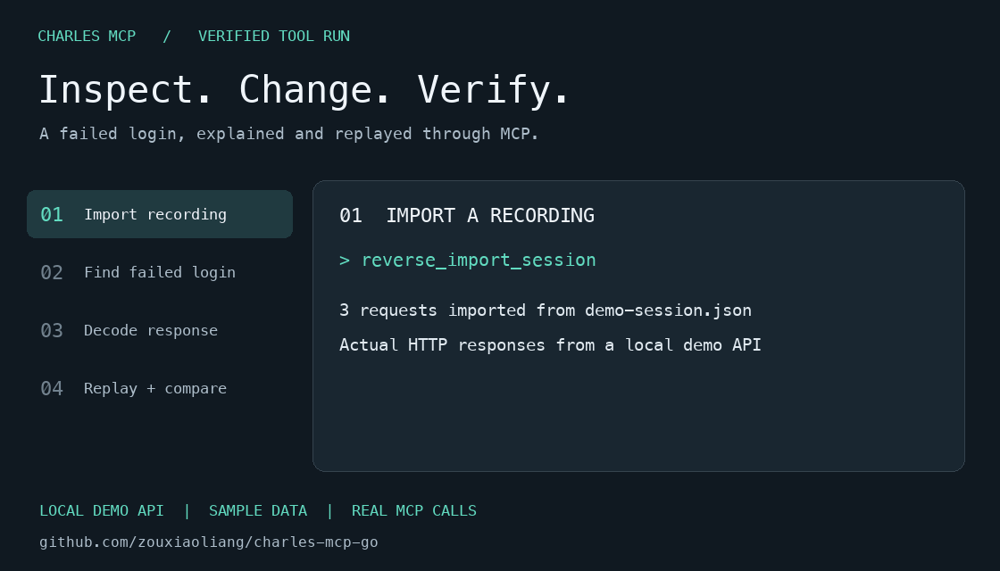

# Charles MCP Go

**Let your AI client inspect Charles traffic, explain API failures, and replay requests with changes.**

**English** · [简体中文](README.zh-CN.md)

[](https://github.com/zouxiaoliang/charles-mcp-go/actions/workflows/ci.yml)
[](https://github.com/zouxiaoliang/charles-mcp-go/releases/latest)
[](LICENSE)

[Download](#install) · [Claude Desktop / Cursor setup](docs/clients.md) · [Try the demo](examples/README.md) · [Tutorials](docs/tutorials/README.md)



*A formatted playback of actual MCP tool results against a local demo API. Uses sample credentials; this is not a recording of an AI client or the Charles UI. [Run it yourself](examples/README.md).*

## What you can do

- **Debug an API failure:** find a request by route, status or body content, then inspect its headers and decoded response.
- **Explore a recording:** import a Charles session, summarize its endpoints and follow login or API flows.
- **Test a change:** replay a request with different headers, query parameters or JSON fields, and compare the result with the original response.
- **Keep the evidence:** captures, decoded bodies, replay experiments and findings persist in a local SQLite database.

One executable for macOS, Linux and Windows. No Python, Node.js, CGO or separate database needed to run the server. Includes 31 upstream tool capabilities plus capture deletion; connects to clients over stdio MCP.

Live capture requires an existing [Charles Proxy](https://www.charlesproxy.com/) installation with its Web Interface enabled. Offline XML and JSON imports work without Charles; supported native ZIP sessions import directly, while other native formats need the Charles CLI for conversion.

## Install

### Download an executable

Choose your system and architecture. These links point to the latest stable release.

| System | amd64 / Intel | arm64 / Apple Silicon |
|---|---|---|
| macOS | [Download](https://github.com/zouxiaoliang/charles-mcp-go/releases/latest/download/charles-mcp-darwin-amd64) | [Download](https://github.com/zouxiaoliang/charles-mcp-go/releases/latest/download/charles-mcp-darwin-arm64) |
| Linux | [Download](https://github.com/zouxiaoliang/charles-mcp-go/releases/latest/download/charles-mcp-linux-amd64) | [Download](https://github.com/zouxiaoliang/charles-mcp-go/releases/latest/download/charles-mcp-linux-arm64) |
| Windows | [Download](https://github.com/zouxiaoliang/charles-mcp-go/releases/latest/download/charles-mcp-windows-amd64.exe) | [Download](https://github.com/zouxiaoliang/charles-mcp-go/releases/latest/download/charles-mcp-windows-arm64.exe) |

On macOS/Linux, run `chmod +x <downloaded-file>`, then rename it to `charles-mcp`. On Windows, rename it to `charles-mcp.exe`. Keep it in a permanent location and use its absolute path in your client configuration.

```sh
./charles-mcp --version
```

On Windows, use `.\charles-mcp.exe --version`. [SHA256SUMS](https://github.com/zouxiaoliang/charles-mcp-go/releases/latest/download/SHA256SUMS) contains checksums for the original download filenames.

### Install with Go

Requires Go 1.26+; the recommended toolchain is pinned in `go.mod`.

```sh
go install github.com/zouxiaoliang/charles-mcp-go/cmd/charles-mcp@latest
```

The executable goes into `GOBIN`, or `$(go env GOPATH)/bin` when `GOBIN` is unset. Add that directory to `PATH`, or use the full path. Re-run the command to upgrade; replace `@latest` with a release tag to pin a version. `--version` and the MCP handshake report the installed module version.

## Connect your AI client

1. For live traffic, open Charles → **Proxy → Web Interface Settings**, enable the interface and set your credentials. Confirm the proxy port; HTTPS capture also requires Charles certificate setup.
2. Add the configuration below to your client. Replace the executable path, proxy address and credentials.
3. Restart or reload the client, enable the `charles` tools and ask it to check the connection.

```json
{
  "mcpServers": {
    "charles": {
      "command": "/absolute/path/to/charles-mcp",
      "env": {
        "CHARLES_PROXY_URL": "http://127.0.0.1:8888",
        "CHARLES_USER": "admin",
        "CHARLES_PASS": "your-web-interface-password"
      }
    }
  }
}
```

[Client guide](docs/clients.md): configuration locations, Windows paths, copyable files and troubleshooting for Claude Desktop and Cursor. Offline import does not require the live connection check to pass.

Try asking:

> Check the Charles connection. Start a capture, then wait while I reproduce the failed login. Read the captured requests, show the failing response and explain what it tells us. Stop the capture when finished.

Or try the [sample session](examples/session.json) without Charles:

> Import `/absolute/path/to/charles-mcp-go/examples/session.json`. Find the failed requests, quote the error messages and suggest what to inspect next.

## Learn through three workflows

| Workflow | What you will get |
|---|---|
| [Find an API error](docs/tutorials/01-debug-api-errors.md) | Filter a capture, identify two 401 responses and inspect their distinct causes. |
| [Map a recorded session](docs/tutorials/02-explore-session.md) | Import a file, group endpoints and inspect the login flow. |
| [Change a request and compare](docs/tutorials/03-replay-and-compare.md) | Run the local MCP demo, change a fixture password and verify a real 401 → 200 replay. |

The tutorials include English and Chinese prompts, concrete tool arguments and expected results. The sample uses reserved example domains and fake data.

## Capabilities and behavior

- Live pagination keeps a stable `entry_id` when a response updates; `peek_live_capture` preserves the cursor. Stop the capture to restore recording if this server started it.
- Filter by host, route, method, status, headers, decoded text and JMESPath. Group by endpoint, status or resource type.
- Decode gzip, Brotli, zstd, deflate, character sets, JSON, forms and multipart. Protobuf requires a binary `FileDescriptorSet` and a fully qualified message type.
- Replay supports query/header changes, JSON Pointer mutations, forms and text bodies. It sends a real HTTP request, retains recorded authentication/cookies, and saves both successful responses and network failures.
- Login, API and signature analysis produce evidence and candidate experiments. Analysis sends no replay requests unless `run_replay=true`; signature rankings are heuristics, not proof of an algorithm.

`charles-mcp --tools` prints the full tool schemas. For detailed semantics, limits and all tool mappings, see the [Chinese reference](README.zh-CN.md) and [feature map](docs/features.md).

## Configuration and local data

Configuration priority: command-line flags → environment → `--config config.json` → defaults. See [config.example.json](config.example.json).

| Variable | Purpose |
|---|---|
| `CHARLES_PROXY_URL` | Charles proxy; default `http://127.0.0.1:8888`; empty means direct access |
| `CHARLES_BASE_URL` | Control endpoint; default `http://control.charles` |
| `CHARLES_USER` / `CHARLES_PASS` | Web Interface credentials; set these to your actual values |
| `CHARLES_MCP_DATA_DIR` | SQLite data directory |
| `CHARLES_RECORDINGS_DIR` | Directory searched by `list_recordings` |
| `CHARLES_CLI_PATH` | Optional Charles executable for native session conversion |

Data stays in the local application config directory: `~/Library/Application Support/charles-mcp` on macOS, `%AppData%\charles-mcp` on Windows, and `$XDG_CONFIG_HOME/charles-mcp` or `~/.config/charles-mcp` on Linux. Captures persist until explicitly deleted. Request and response headers are preserved, including credentials; redact recordings before sharing them in issues.

The server writes protocol messages to stdout and logs to stderr. It is a stdio MCP server; the AI client starts it as a child process.

## Build and contribute

```sh
git clone https://github.com/zouxiaoliang/charles-mcp-go.git
cd charles-mcp-go
go build -o bin/charles-mcp ./cmd/charles-mcp
go test -race ./...
go vet ./...
bash scripts/build-release.sh
```

CI checks formatting and dependencies, runs tests on Linux/macOS/Windows, and builds six binaries. Pushing a version tag such as `v1.2.3` publishes a Release after all checks pass. Pre-release tags such as `v1.2.3-rc.1` become GitHub prereleases. Local source builds report `dev`; `VERSION=v1.2.3 bash scripts/build-release.sh` embeds an explicit version and produces `dist/SHA256SUMS`.

See [CONTRIBUTING.md](CONTRIBUTING.md), [report a bug](https://github.com/zouxiaoliang/charles-mcp-go/issues/new/choose), or browse [good first issues](https://github.com/zouxiaoliang/charles-mcp-go/issues?q=is%3Aissue%20is%3Aopen%20label%3A%22good%20first%20issue%22). If the project helps your debugging workflow, a Star helps other Charles users find it.

## License and credits

[MIT](LICENSE). Reimplements the public tool capabilities of [heizaheiza/Charles-mcp](https://github.com/heizaheiza/Charles-mcp) in Go. See [PROVENANCE.md](PROVENANCE.md) for attribution and scope. This project is not affiliated with Charles Proxy, Anthropic or Cursor.
